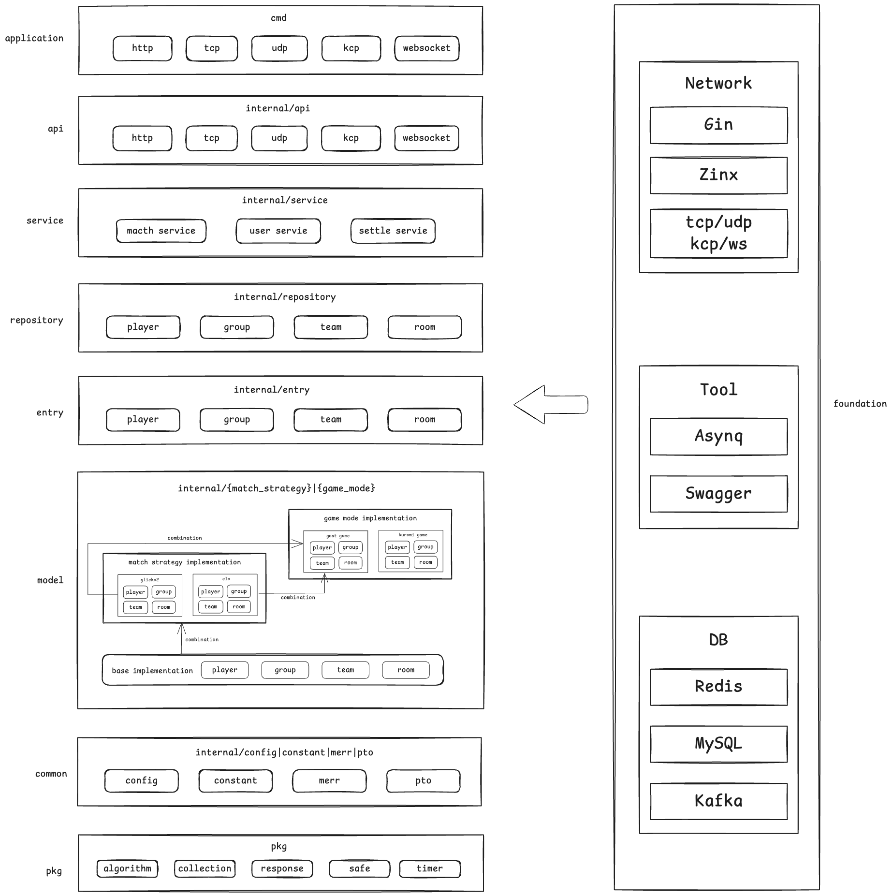

# go-matcher

[](https://goreportcard.com/report/github.com/hedon954/go-matcher)
[](https://codecov.io/github/hedon954/go-matcher)
[](https://github.com/hedon954/go-matcher/actions)
[](https://github.com/hedon954/go-matcher/releases)

Go-matcher is a game matcher implement in Go, which supports add game mode and match strategy easily.

- `GameMode`: The identifier of each different game, used to define as enum.
- `MatchStrategy`: The strategy to match players, used to define as interface.


## Features

- [ ] API
  - [x] HTTP
  - [ ] TCP
  - [ ] UDP
  - [ ] KCP
  - [ ] WebSocket
- [x] Service
  - [x] match service
- [x] Swagger Doc
- [ ] timer
  - [x] native timer
  - [x] asynq timer
  - [ ] redis timer

- [x] GameMode
  - [x] GoatGame
- [x] MatchStrategy
  - [x] Glicko2


## Architecture




## Problems

- [ ] change match strategy dynamic according to config changes
- [ ] lack of `GameEnd` and `Ready` services。


## Todo

- [ ] connectorRPC
- [ ] tcp
- [ ] udp
- [ ] kcp
- [ ] websocket
- [ ] dynamic config
- [ ] logger
- [ ] tracer
- [ ] opentelementry
- [ ] repository stats
- [ ] match queue stats


## Help

### Before writing code

```bash
bash ./setup_pre_commit.sh
```

### Start asynq web UI `Asynqmon`

```bash
# clone repo
git clone git@github.com:hibiken/asynqmon.git
# enter repo
cd asynqmon
# check node version
node -v
# if higher 16, should degrade it
# install nvm if not
curl -o- https://raw.githubusercontent.com/nvm-sh/nvm/v0.39.1/install.sh | bash
# install node 16
nvm install 16
# use node 16
nvm use 16
# install yarn if not
brew install yarn
# build asynqmon
make build
# start asynqmon
./asynqmon
```