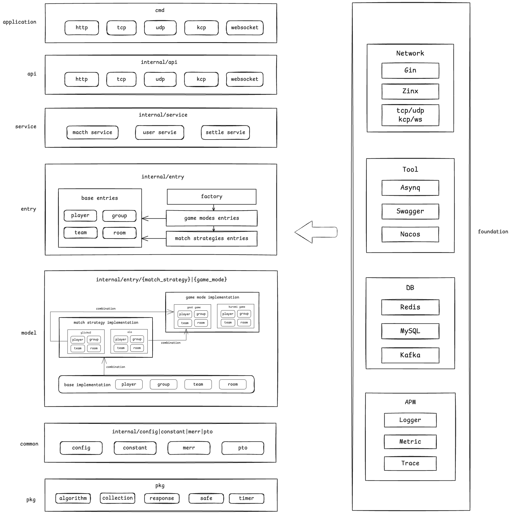
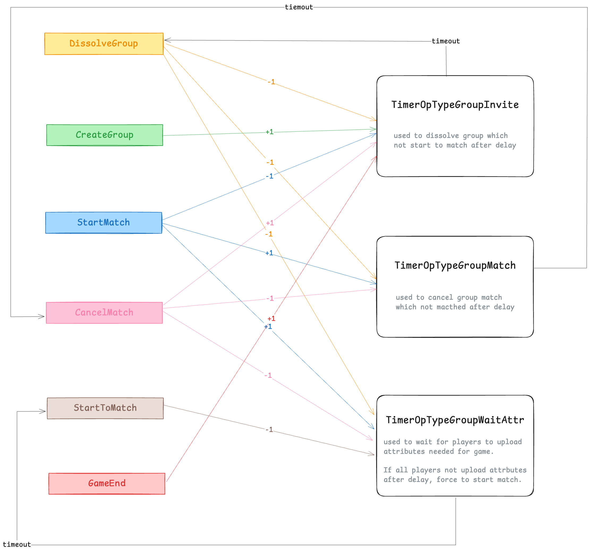
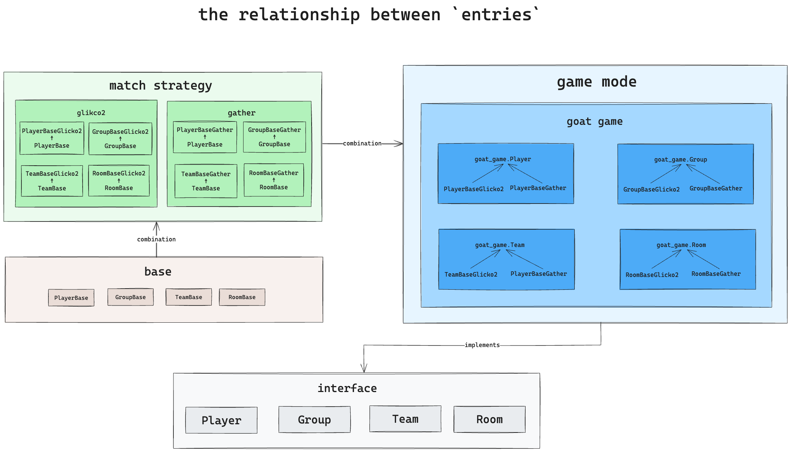

# go-matcher

[](https://goreportcard.com/report/github.com/hedon954/go-matcher)
[](https://codecov.io/github/hedon954/go-matcher)
[](https://github.com/hedon954/go-matcher/actions)
[](https://github.com/hedon954/go-matcher/releases)

Go-matcher is a game matcher implement in Go, which supports add game mode and match strategy easily.

- `GameMode`: The identifier of each different game, used to define as enum.
- `MatchStrategy`: The strategy to match players, used to define as interface.


## Features

- [ ] API
  - [x] HTTP
  - [x] TCP
  - [ ] UDP
  - [ ] KCP
  - [ ] WebSocket
  - [ ] gRPC
- [ ] Service
  - [x] match service
  - [ ] push service
  - [ ] settle service
- [x] Swagger Doc
- [ ] timer
  - [x] native timer
  - [x] asynq timer
  - [ ] redis timer

- [x] GameMode
  - [x] GoatGame
- [ ] MatchStrategy
  - [x] Glicko2
  - [ ] Gather
  - [ ] ELO
- [ ] AI Generator


## Architecture




## Smoke flow


## State Machine



## Entry Design



## Todo

- [ ] network
  - [ ] UDP
  - [ ] KCP
  - [ ] WebSocket
  - [ ] gRPC
- [x] static config
  - [x] yaml
- [ ] dynamic config
  - [ ] nacos
  - [ ] etcd
  - [ ] apollo
  - [ ] consul
- [ ] tracer
- [ ] open telemetry
- [ ] repository stats
- [ ] match queue stats
- [ ] graceful restart
- [ ] repository by redis
- [ ] hot upgrade
- [ ] horizontal expansion
- [ ] AI Generator


## Schedule

- [x] HandleMatchSuccess（8.9）
- [x] HandleGameResult（8.9）
- [x] Ready & Unready（8.9）
- [ ] Push Service by gRPC（8.12）
- [x] Static Config（8.13）
- [ ] Dynamic Config by nacos（8.13）
- [ ] repository by redis（8.14）
- [ ] entry encode & decode（8.14）
- [ ] zerolog logger & tracer & open telemetry（8.15-8.16）
- [ ] repository stats & match queue stats（8.19）
- [x] zinx（8.20-8.23）
- [x] TCP api（8.26）
- [ ] WebSocket api（8.27）
- [ ] AI Generator

## Help

### Before writing code

```bash
bash ./setup_pre_commit.sh
```

### Start asynq web UI `Asynqmon`

```bash
# clone repo
git clone git@github.com:hibiken/asynqmon.git
# enter repo
cd asynqmon
# check node version
node -v
# if higher 16, should degrade it
# install nvm if not
curl -o- https://raw.githubusercontent.com/nvm-sh/nvm/v0.39.1/install.sh | bash
# install node 16
nvm install 16
# use node 16
nvm use 16
# install yarn if not
brew install yarn
# build asynqmon
make build
# start asynqmon
./asynqmon
```

### How to use Open Telemetry

[Open Telemetry](https://opentelemetry.io/docs/languages/go/getting-started/)

### Start jaeger

```bash
docker run -d --name jaeger \
  -e COLLECTOR_OTLP_ENABLED=true \
  -p 16686:16686 \
  -p 4317:4317 \
  -p 4318:4318 \
  jaegertracing/all-in-one:latest
```