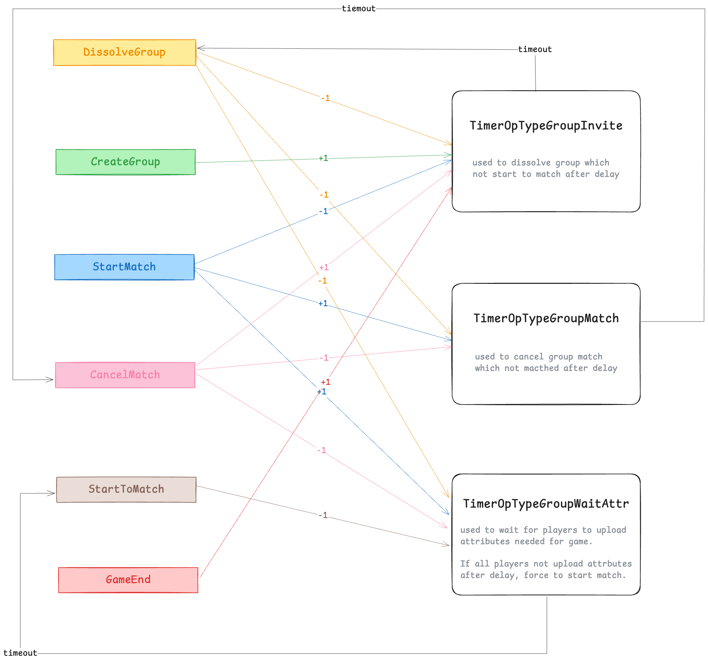

# Match Service

## Delay Timers
The Delay Timer system ensures that certain operations such as group dissolution, match cancellation, and attribute uploads are managed within specified time limits to enhance user experience and system reliability.

### Purpose
The Delay Timer system manages three main types of timeouts:

1. Group Invitation Timeout (TimerOpTypeGroupInvite):
    - Purpose: Automatically dissolves groups that do not start a match within a specified delay to save memory.
    - Trigger: Dissolves the group and notifies players if the timeout expires.
2. Match Timeout (TimerOpTypeGroupMatch):
   - Purpose: Cancels matches that have not successfully started within a specified delay.
   - Trigger: Cancels the match and notifies players if the timeout expires.
3. Attribute Upload Timeout (TimerOpTypeGroupWaitAttr):
   - Purpose: Ensures all players upload necessary attributes for the game within a specified delay. If not, the match is forced to start.
   - Trigger: Forces the match to start if the timeout expires.

### Diagram
The diagram below illustrates the relationships and transitions between different operations and their corresponding timers:

